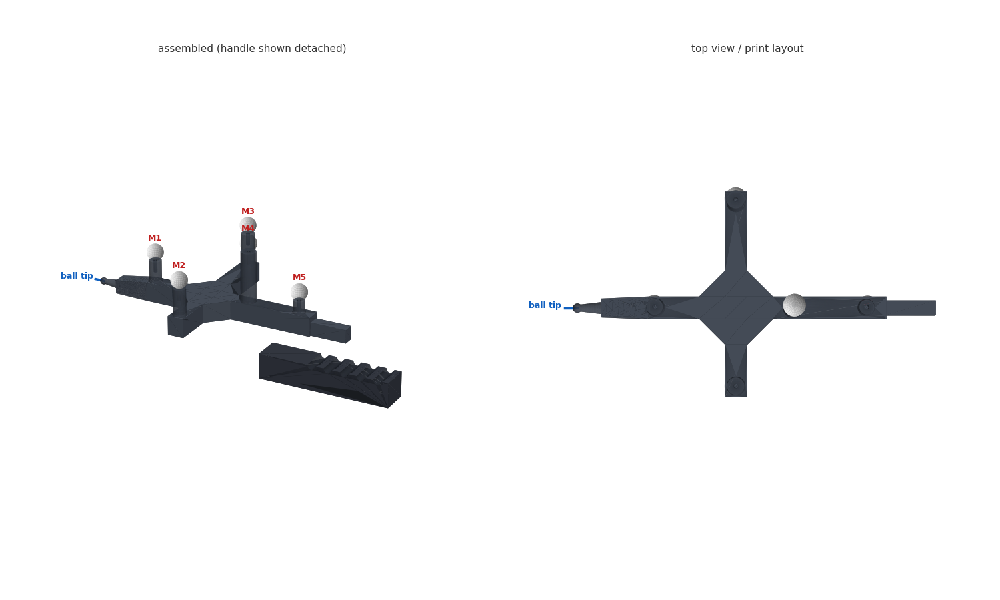

# Printed measurement tip (ART pointer replacement)

A 3D-printable 6DoF pointer for OST calibration, in place of the ART Measurement
Tool. Five reflective markers on a rigid cross, and a printed ball stylus as the
measurement point. Fully printed apart from the markers themselves.



## Files

| File | What it is |
| --- | --- |
| `measurement_tip.py` | Parametric FreeCAD script - the source of truth |
| `measurement_tip.FCStd` | FreeCAD document (all parts plus the marker spheres) |
| `measurement_tip.step` | STEP for any other CAD package |
| `tip_body.stl`, `handle.stl`, `stylus.stl` | Ready to slice, already in print orientation |
| `markers.json` | Nominal marker coordinates in the tip frame, for the rigid-body definition |
| `opt_markers.py` | The solver that produced the marker layout |

Regenerate everything after editing the parameter block:

```
"C:\Program Files\FreeCAD 1.1\bin\freecadcmd.exe" measurement_tip.py
```

## Marker layout

Frame: origin at the stylus ball centre, +X toward the handle, +Z out of the
marker face.

| Marker | X | Y | Z | Post |
| --- | ---: | ---: | ---: | ---: |
| M1 | 43.0 | 0.0 | 31.0 | 16.0 |
| M2 | 86.5 | -42.5 | 35.0 | 20.0 |
| M3 | 86.5 | 57.0 | 39.0 | 24.0 |
| M4 | 117.5 | 0.0 | 52.5 | 37.5 |
| M5 | 157.0 | 0.0 | 24.0 | 9.0 |

Nothing here is symmetric, and every asymmetry is load-bearing:

- **All ten pairwise distances are distinct**, the closest two differing by
  **5.33 mm** (48.7 / 55.4 / 60.9 / 66.3 / 72.1 / 77.5 / 83.1 / 91.9 / 99.6 /
  114.2 mm). That margin is what lets the tracker label individual markers and
  tell this body apart from others.
- **Every 4-marker subset is non-coplanar**, the worst at **6.52 mm** of
  out-of-plane extent. This is why all five posts are different heights, and it
  is a stronger requirement than it first looks. A planar marker set has a
  mirror-flip pose ambiguity, so a body that is non-planar only thanks to one
  raised marker becomes *ambiguous* the moment that marker is occluded - not
  merely less accurate. The solver can then jump to the mirrored pose, which
  swings the tip by twice the lever arm and still looks like a valid reading.
  An earlier revision with four markers at one height and one raised scored
  27.5 mm out-of-plane for the full set but **0.00 mm** for its worst 4-subset;
  it was rejected for exactly this reason.

Distinct heights also stop markers merging in projection. With M1/M5 at equal
height they coincide when viewed along the shaft, and M2/M3 coincide from the
side.

`opt_markers.py` maximises the distance gap subject to a hard 6 mm floor on the
worst 4-subset, using differential evolution (a hill-climb was too high-variance
here - two runs of the same problem differed by 1 mm in the objective). Post
heights are bounded per marker to match how stiff each mounting point is: the
nose is tapered and the arms are cantilevered, so those posts stay short and the
tallest sits on the mid-shaft. Enforcing the floor costs almost nothing - the
gap only drops from 5.78 mm to 5.33 mm, and the tallest post gets *shorter*,
43 mm to 37.5 mm.

If you change any dimension, re-run `opt_markers.py` and check both numbers.

## The stylus

The measurement point is a printed **5 mm ball**, not a printed point, and that
is deliberate.

A 0.4 mm nozzle cannot make a point. A printed "sharp" tip comes out a blob
roughly one extrusion wide, it deforms the first time you lean on it, and its
contact patch shifts as you tilt the tool - so the pivot calibration it feeds is
biased by however you happened to hold it during calibration.

Pivoting a **sphere** in a divot recovers the sphere *centre* exactly, at any
tilt, and the ball diameter cancels out of the maths entirely. The tip offset
stops depending on tip sharpness, which is the one thing FDM cannot deliver.
This is why CMM styli are ruby spheres and not needles. A sphere is also the
better sighting target for SPAAM: it presents the same silhouette from every
direction, so there is no foreshortening bias when you line it up on the
crosshair.

It is a separate part for three reasons: the ball cannot print on the
lying-flat body (its underside would be an unsupported overhang), standing
upright it is fully self-supporting, and it becomes the cheap replaceable wear
item. The joint is a 4 mm plug into a teardrop bore plus a 45 degree conical
seat that self-centres and sets insertion depth, so a replacement stylus lands
in the same place.

Reach is 13 mm from the nose face to the ball centre. That is much shorter than
the needle it replaces but still keeps the nose corner clear of the workpiece
down to about 21 degrees from horizontal, which is what bounds your pivot cone.

Set `TIP_STYLE = "cone"` for a conical point instead, if your calibration method
needs to touch a specific surface feature rather than seat in a divot. Everything
above is the argument against it - use it only if you need it. A 5 mm steel ball
bearing glued into a stubbed stylus is the accuracy upgrade if you ever want one.

## Bill of materials

- 5x 12 mm retroreflective marker with an M3 male stud (any brand)
- Cyanoacrylate for the stylus and, optionally, the handle joint

Nothing else. The stud holes are 2.5 mm pilots meant to be tapped M3 or self-tapped. For M3
heat-set inserts set `STUD_D = 4.0` and re-run. If your markers use a different
base height, set `BASE_TO_CENTRE` so the sphere centres land on the table above -
the printed geometry adjusts and the marker distances stay exactly as solved.

Post shank diameter scales with post length (7 mm to 11 mm), because a tall thin
post would be the softest link in the chain and post flex is measurement error.
The conical base is capped at the beam width: any wider and it hangs off the side
of the beam with nothing under it, which would force supports.

## Printing

**No supports anywhere.** Body and handle lie flat with every post pointing up;
the stylus stands on its plug. This is checked rather than assumed - every
downward-facing facet in all three STLs is at 45 degrees or steeper, apart from
the handle's socket ceiling, which is an 8.5 mm bridge.

That constraint shapes several features: the nose tapers only in width so its
underside stays on the bed, post base flares are capped at the beam width, and
the stylus bore is a teardrop rather than a round hole. A plain horizontal bore
has a flat ceiling that droops into the hole, which would tilt the stylus off
axis - the one place on this tool where that actually costs accuracy.

- Tip body: 182 x 111.5 x 51.5 mm, 57 cm3
- Handle: 95 x 20 x 18 mm, 30 cm3
- Stylus: 6.5 x 6.5 x 28.8 mm, 0.5 cm3 - **print with a brim**, it stands on a
  4 mm plug and is otherwise easy to knock over. Print a few spares, they cost
  nothing.
- PETG, ASA or a CF-filled filament. Avoid PLA - it creeps, and a pointer that
  creeps quietly invalidates its own calibration.
- 4 perimeters, >= 40% infill, 0.2 mm layers. Stiffness matters far more than
  surface finish; any flex between the markers and the point is measurement error.
- For the stylus only, drop to 0.12 mm layers and use 100% infill. It is a
  half-gram part and the ball's sphericity is the tip's accuracy floor.

## Assembly

1. Tap the five post holes M3 (or press in heat-set inserts) and screw on the markers.
2. Glue the stylus into the nose bore, pushed home until its collar seats on the
   face. Clear any elephant's foot off the plug first so it seats fully.
3. Slide the handle onto the keyed tenon. The joint sits behind M5, so it carries
   no tracked geometry - friction is enough, glue it if you prefer.

## Use

Define the rigid body in your tracking software (wand/registration as usual, or
seed it from `markers.json`), then run your pivot calibration to get the tip
offset. Treat the nominal origin as a starting guess only - pivot calibration
measures the real thing, and with a ball tip what it returns is the ball centre.

If you probe surfaces rather than divots, remember the contact point is one ball
radius (2.5 mm) off the centre along the surface normal. For sighting the tip
against a crosshair, and for seating in a divot, the centre is what you want and
no compensation applies.

Three practical limits versus the ART tool. Printed plastic is dimensionally less
stable than ART's carbon/aluminium construction, so re-run the pivot calibration
if the tool has been in a hot car or dropped. The ball's sphericity is set by
your printer, so it is the accuracy floor - expect a couple of tenths, not the
micron-level of a ground ruby. And all five markers face one way - hold the
marker face toward the cameras; rolling the tool over will drop tracking.

## Not included

A pivot divot to calibrate against. A short block with a 60 degree conical
depression is trivial to add if your own calibration method wants one - and with
a ball stylus a cone is exactly the right seat, since it constrains the ball
centre in all three axes.
